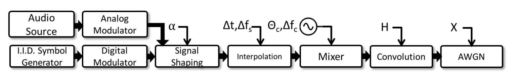

# Modulation recognition using Persistent Homology

The aim of this project is to test feature generation pipeline using persistent homology 
with application to modulation classification problem.

## About the dataset

The dataset consists of synthetic and over-the-air radio signals with different modulations. 
It was generated as a basis of the paper [[1]](#1). 
Signals with various modulation types were generated using the following schema




| Modulation types   |
|--------------------|
| OOK                |
| 4ASK               |
| 8ASK               |
| BPSK               |
| QPSK               |
| 8PSK               |
| 16PSK              |
| 32PSK              |
| 16APSK             |
| 32APSK             |
| 64APSK             |
| 128APSK            |
| 16QAM              |
| 32QAM              |
| 64QAM              |
| 128QAM             |
| 256QAM             |
| AM-SSB-WC          |
| AM-SSB-SC          |
| AM-DSB-WC          |
| AM-DSB-SC          |
| FM                 |
| GMSK               |
| OQPSK              |


## How to run this project

### Setting up virtual environment and installing requirements

After cloning the repository set up virtual environment and install requirements

```
python -m venv venv 
source venv/bin/activate
pip install -r requirements.txt
```

### Runing the project using DVC

This project uses DVC (Data Version Control) to run data processing pipelines. 
To download datasets set-up password to remote SSH storage, and pull the data:
```
dvc remote modify --local ssh-storage password [put_password_here]
dvc pull
```

Run the "spotcheck" stage to see the ranking of classifiers
```
dvc repro spotcheck
```

Run the "evaluate_model" stage to see performance of the best model
```
dvc repro evaluate_model
```

To see the accuracy of the best model and its confusion matrix run
```
dvc metrics show
dvc plots show
```

### Running the project without access to remote storage (precomputed persistence diagrams)

If you don't have access to remote storage, you can run the project by downloading file `diagrams.pkl`
precomputed peristence diagrams. To do so, run the following commands:

```
mkdir data
cd data
wget data.tar.gz https://mat.ug.edu.pl/~jprzew/TDA/diagrams.pkl
```

Now you can reproduce spotcheck and evaluate_model stages as described above. Remember that stages: train_test_split,
sample_data and diagrams are frozen and will not be reproduced.

### Running the project with the original dataset

The original data can be downloaded from the DeepSig website: https://www.deepsig.ai/datasets. To run the project type:

```
tar -xvzf 2018.01.OSC.0001_1024x2M.h5.tar.gz
mkdir data
cp 2018.01/GOLD_XYZ_OSC.0001_1024.hdf5 data
```

Unfreeze the stages: train_test_split, sample_data and diagrams by editing `dvc.yaml` file 
(remove `freeze=true` where necessary) and reprodce stages spotcheck and evaluate_model as described above.


### Seeing the results

To see the results of the ML-pipeline run the following commands:
```
dvc metrics show
dvc plots show
```

## References

<a id="1">[1]</a>
Timothy James O'Shea, Tamoghna Roy, and T. Charles Clancy.
"Over-the-air deep learning based radio signal classification."
IEEE Journal of Selected Topics in Signal Processing, 12(1):168–179, February 2018

<a id="2">[2]</a>
Carlsson, Gunnar. "Topology and data." Bulletin of the American Mathematical Society 46.2 (2009): 255-308

